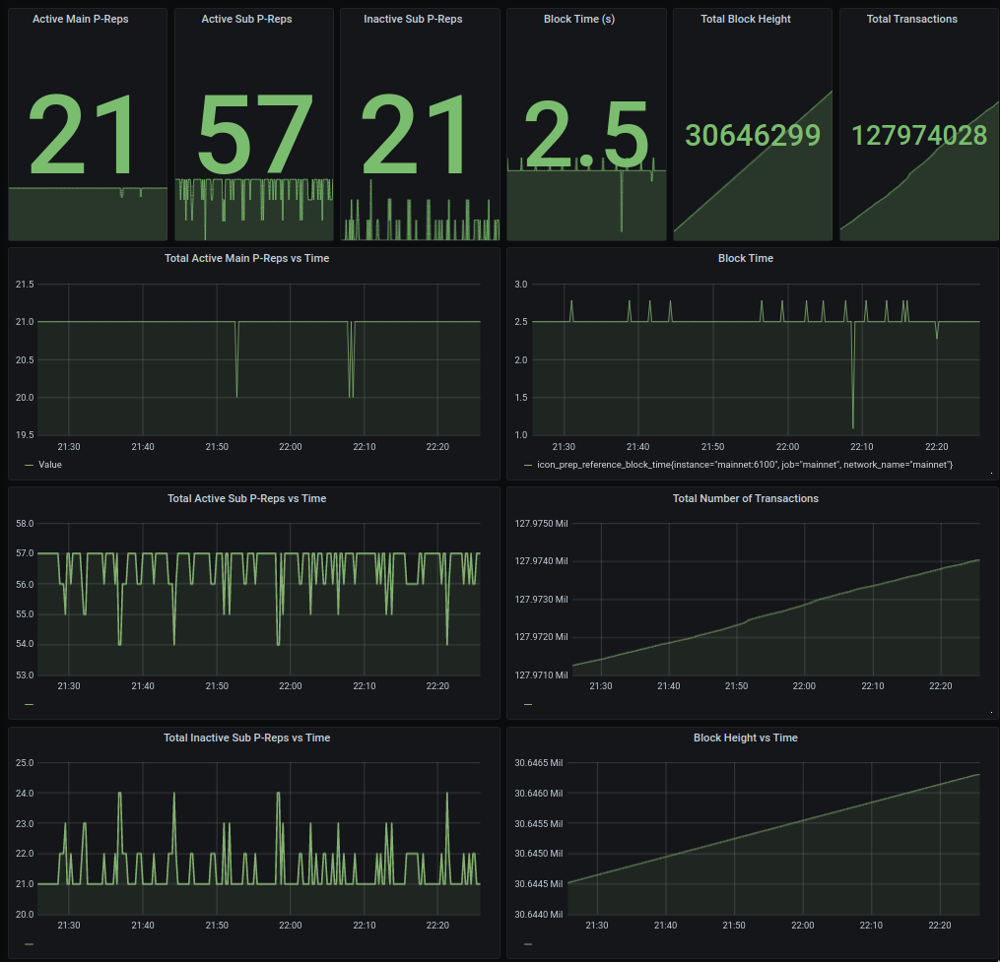

## icon-network-exporter

This is a python agent that discovers nodes and extracts metrics provided through each node's REST API. Clone and run the python agent on your server and use port 6100 to get your prometheus server to scrape the metrics from this agent.

To install the icon-prometheus-exporter package.

### Metrics 

- **icon_prep_block_height** - Node block height
- **icon_prep_status** - Number to indicate node status - ie Vote=1, Watch=2
- **icon_prep_node_rank** - Rank of the node
- **icon_prep_block_time** - Time in seconds per block for a node
- **icon_prep_reference_block_height** - Block height of reference node
- **icon_prep_reference_block_time** - Time in seconds per block
- **icon_total_tx** - Total number of transactions
- **icon_total_active_main_preps** - Total number of active nodes above rank 22
- **icon_total_active_sub_preps** - Total number of inactive validators - (nodes off / in blocksync)

**There are more metrics.  Check tests and source for complete list. 

### Environment Variables

> Case insensitive

| Name | Default | Description | 
| :--- | :--- | :--- | 
| network_name |  | mainnet, zicon, bicon, testnet | 
| exporter_port | 


### Manually
```bash
cd icon-prometheus-exporter
python setup.py install
```

### Docker Compose 

Easiest way to run. Modify per networks you are interested in. 
```
docker-compose up -d
```

### Docker

Pull container
```bash
docker run -p 6100:6100 -it geometrylabs/icon-network-exporter:v0.3.0
```

Build from source:
```bash
docker build -t icon-network-exporter .
docker run -it icon-network-exporter 
```

To verify
```bash
curl localhost:6100/metrics
```

### Example Dashboard

Metrics from this exporter are driving dashboards like this. 



## Credit

- Special thanks to Haitham Ghalwash who built the first version of this module for his Insight fellowship. 
